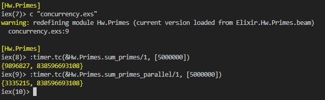
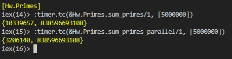

### Sebastian González, A01029746
### Karla Mondragón, A01025108
<br>

# Funciones

Como se observa en el programa, se utiliza la concurrencia y la programación paralela. <br> <br>

El programa consiste en dos funciones principales `sum_primes(linferior, lsuperior)` y `sum_primes_parallel(limit)`. La primera función consiste en ingresar un límite inferior y/o superior y sumar todos los números primos de manera secuencial. La segunda función recibe solamente un limite superior y suma los números primos dentro del límite de manera paralela, calculando el número de threads.<br> <br>

Ambas funciones se apoyan de `is_prime(n)` que regresa un booleano si el número ingresado es primo (`true`) o no (`false`). <br>

Para correr este programa se necesita ingresar el siguiente comando a la terminal  
`iex concurrency.exs` y al entrar en el modo interactivo llamar a las funciones de las siguientes maneras:
```
Hw.Primes.sum_primes(n) 
Hw.Primes.sum_primes(n, c)
Hw.Primes.sum_primes_parallel(n)
Hw.Primes.sum_primes_parallel(n, n_of_threads)
```

Para encontrar el tiempo de que toma cada función, de igual manera se entra al modo interactivo pero se hace lo siguiente:
```
:timer.tc(&Hw.Primes.sum_primes/1, [n]) 
:timer.tc(&Hw.Primes.sum_primes/2, [n, c])
:timer.tc(&Hw.Primes.sum_primes_parallel/1, [n])
:timer.tc(&Hw.Primes.sum_primes_parallel/2, [n, n_of_threads])
```
<br>

# Análisis del Tiempo

Con respecto al tiempo de ejecución, se hicieron las siguientes pruebas con un límite superior de 5,000,000:


<br>


* Como se puede observar, en ambos casos el resultado de la suma de todos los números primos de $1 - 5,000,000$ es $838,596,693,108$.
* En la primera prueba `sum_primes` tardó más de $9,000,000$ de microsegundos o $9$ segundos, mientras que `sum_primes_parallel` tuvo un tiempo de un poco más de $3,000,000$ de microsegundos o $3$ segundos. 
* Para la segunda prueba `sum_primes` tardó más de $10,000,000$ de microsegundos o $10$ segundos, mientras que `sum_primes_parallel` se mantuvo en un poco más de $3,000,000$ de microsegundos o $3$ segundos y de hecho obtuvo un menor tiempo que en la prueba anterior. 
* Como se pudo observar en las pruebas presentadas, el rendimiento de `sum_primes` empeora con cada vez que se corre la función mientras que `sum_primes_parallel` mantiene su rendimiento.
 <br> <br>

## Speedup

Con respecto al $speedup$ $S$<sub>$p$</sub> $=$ $T$<sub>$1$</sub> $/$ $T$<sub>$p$</sub> donde,
* $p$ es el n ́umero de procesadores (o núcleos).
* $T$<sub>$1$</sub>  es el tiempo que tarda en ejecutarse la versi ́on secuencial del programa.
* $T$<sub>$p$</sub> es el tiempo que tarda en ejecutarse la versi ́on paralela del programa utilizando p procesadores.
* $S$<sub>$p$</sub> es el speedup obtenido usando p procesadores. <br> 

Para la prueba 1, el speedup es: $$\frac{9896827}{3335215} = 2.967$$

Para la prueba 2, el speedup es: $$\frac{10339657}{3206140} = 3.225$$
<br>

La diferencia entre los tiempos y el $speedup$ demuestra el impacto de la programación paralela y concurrente en la eficiencia del tiempo de un programa. Al dividir tareas y realizarlas en paralelo se aprovechan los núcleos del CPU y se ahorran recursos, en este caso, tiempo de ejecución -que en algunos casos puede ser lo más importante-.
