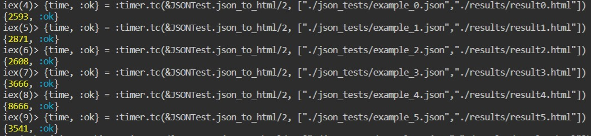
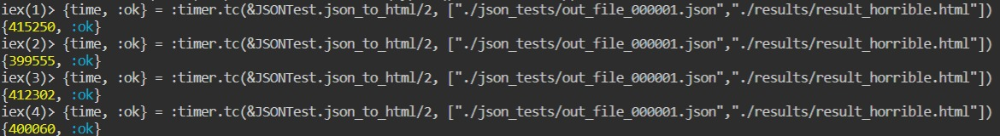

### Sebastian González, A01029746
### Karla Mondragón, A01025108
 

# Reflexión 
1. Reflexiona sobre la solución planteada, los algoritmos implementados y sobre el tiempo de ejecución de estos.
2. Calcula la complejidad de tu algoritmo basada en el número de iteraciones y contrástala con el tiempo obtenido en el punto 7.

Como se observa en el programa, solamente se utiliza un mapa y una función recursiva. A pesar de la sencillez de la estructura, se optó por usar Regex.run() y Regex.replace() los cuales aumentan la complejidad del programa. Debido a las características de las propiedades utilizadas, la complejidad se aproxima a $n^3$. 

 

Tanto como Regex.run() como Regex.replace() funcionan iterando la línea ingresada hasta que se encuentran todos los tokens, por lo que un cálculo acertado de la complejidad del algoritmo es sumamente complicado ya que depende de la cantidad de caractéres y de la cantidad de tokens en una sola línea. Es gracias a estas complicaciones que se deduce que la complejidad del algoritmo es mayor a $n^2$ pero menor a $n^3$.

 

Para calcular el tiempo de ejecución se utilizó una función contenida en el modulo de timer que nos permite obtener el tiempo en **microsegundos** en el que una función regresa cierto resultado. Los resultados arrojados son los siguientes:
 
 

 
A manera de prueba y por mera curiosidad tambien se calculó el tiempo para un archivo mucho más grande y los resultados fueron los siguientes:
 
 

 