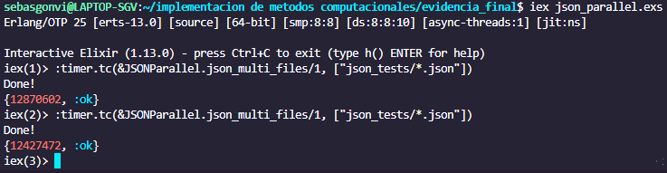

### Sebastian González, A01029746
### Karla Mondragón, A01025108
 

# Reflexión 
1. Reflexiona sobre la solución planteada, los algoritmos implementados y sobre el tiempo de ejecución de estos.
2. Calcula la complejidad de tu algoritmo basada en el número de iteraciones y contrástala con el tiempo obtenido en el punto 7.

El programa consta de varias funciones cuyas tareas en conjunto llevan a cabo el resaltado de sintaxis. Las funciones son las siguientes:
- **json_to_html(in_filename, out_filename)**: Recibe como argumentos un nombre de archivo de entrada y un nombre de archivo de salida como string. Esta función se encarga de procesar los contenidos del archivo de entrada adecuadamente, aplicarle el resaltado de sintaxis y generar el archivo HTML de salida.

- **regex(string)**: Recibe como argmento un string que representa una parte del archivo JSON y lo manda a la función do_regex() junto con otro string vacío.

- **do_regex(string, res)**: Recibe como argmuento un string de entrada (JSON) y uno de resultado. En esta función es que se implementa la lógica necesaria para reconocer las expresiones léxicas de JSON y asignarles una clase de CSS para su posterior resaltado. Las diferentes clases de objetos de un JSON se reconocen con el uso de condiciones. Dentro de cada condición primero se comprueba que se haya encontrado cierto objeto con el uso de Regex, en caso de que esto sea verdadero, se obtiene el objeto identificado como un string y se agrega al string de resultado junto con los tags de HTML y clase correspondiente (Ej. <"span class='object-key'>#{**objeto**}</span">). Posteriormente se hace una llamada recursiva de esta función con el string de JSON sin los elementos que se encontraron en esa iteración (usando remove_find()) y el resultado actualizado.

- **remove_find(full, find)**: Recibe como argumentos un string completo y los caractéres que se quieren eliminar de este. Elminia el tamaño en bytes de lo que se quiere eliminar del string completo.

- **json_multi_files(in_path)**: Recibe como argumento el path de los archivos de entrada y llama a la función do_json_multi_files() con la lista de los archivos JSON contenidos en el path especificado y el tamaño de esa lista.

- **do_json_multi_files(list, n)**: Recibe como argumentos una lista de archivos JSON y un numero que representa el numero de archivos en esa lista. Con el uso de pattern matching y recursión de cola aplica la función json_to_html() a cada uno de los archivos de la lista de manera secuencial.

- **json_html_par(input_path)**: Recibe como argumento el path de los archivos de entrada y llama a la función json_html_par_fpt() con la lista de los archivos JSON contenidos en el path especificado y el tamaño de esa lista que representa los threads que se busca utilizar.

- **json_html_par_fpt(jsonList, threads)**: Recibe como argumento la lista de archivos JSON y el número de threads que se quiere utilizar. Esta función es la responsable de la paralelización del proceso de resaltado de sintaxis al llamar una tarea asincrónica para cada uno de los archivos de la lista y aplicandole la función json_to_html().

***
Para calcular la complejidad temporal se considero primero la función de Enum.map() que le aplica la función regex() a todos los datos, haciendo la complejidad $n$. En esta función, todos los métodos utilizados son constantes, por ejemplo el Regex que en vez de buscar en todo el string, trata de encontrar cierto elemento al inicio de la linea. El único paso que no es constante es la concatenación del string de resultado, que agrega cada linea a si mismo, haciendo que la complejidad se vuelva $n\times r$ en donde $r$ es el número de renglones por archivo de entrada.

Para la parte paralela lo único que se tiene que hacer es múltiplicar esto por la cantidad de archivos de entrada que se introducen.

***

La versión anterior de este programa (json_parallel.exs) utilizaba ciertas funciones para generar el resultado del resaltado léxico que por su naturaleza aumentaban drásticamente su complejidad. En la Actividad Integradora anterior se estimó que la complejidad temporal de esa implementación se aproximaba a la $n^3$, lo cuál hacia el programa sumamente ineficiente y lento, cosa que se comprobó al empezar a aumentar el tamaño de los archivos JSON que se estaban trabajando. Afortunadamente para la última versión del programa (json_parallel2.exs) se encontró un método mucho más eficiente y esto se ve reflejado directamente en el tiempo de ejecución a continuación.

***

Para calcular el tiempo de ejecución se utilizó una función contenida en el modulo de timer que nos permite obtener el tiempo en **microsegundos** en el que una función regresa cierto resultado. Se hicieron 10 llamadas a ambas funciones secuencial y paralela y con esto se obtuvo un promedio de los tiempos de ejecución.
 
 

<figcaption align = "center"><b>Fig.1 - Resultados función secuencial</b></figcaption>
 
 

<figcaption align = "center"><b>Fig.2 - Resultados función paralelo</b></figcaption>
 
El tiempo promedio de la llamada secuencial fue de 292,087 microsegundos mientras que el tiempo para la llamada paralela fue de 111,111 microsegundos. Con esto se comprueba que el mismo proceso llevado a cabo en paralelo resulta en una reducción de un poco más de la mitad del tiempo de ejecución para este programa.

***
A manera de contraste se tomaron los tiempos secuenciales y paralelos de la implementación anterior del resaltador de sintaxis. Se puede observar una diferencia abismal entre los tiempo de la nueva versión y de la vieja.
 
 

<figcaption align = "center"><b>Fig.3 - Resultados función secuencial versión anterior</b></figcaption>
 

<figcaption align = "center"><b>Fig.4 - Resultados función paralela versión anterior</b></figcaption>
 